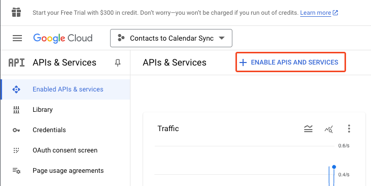
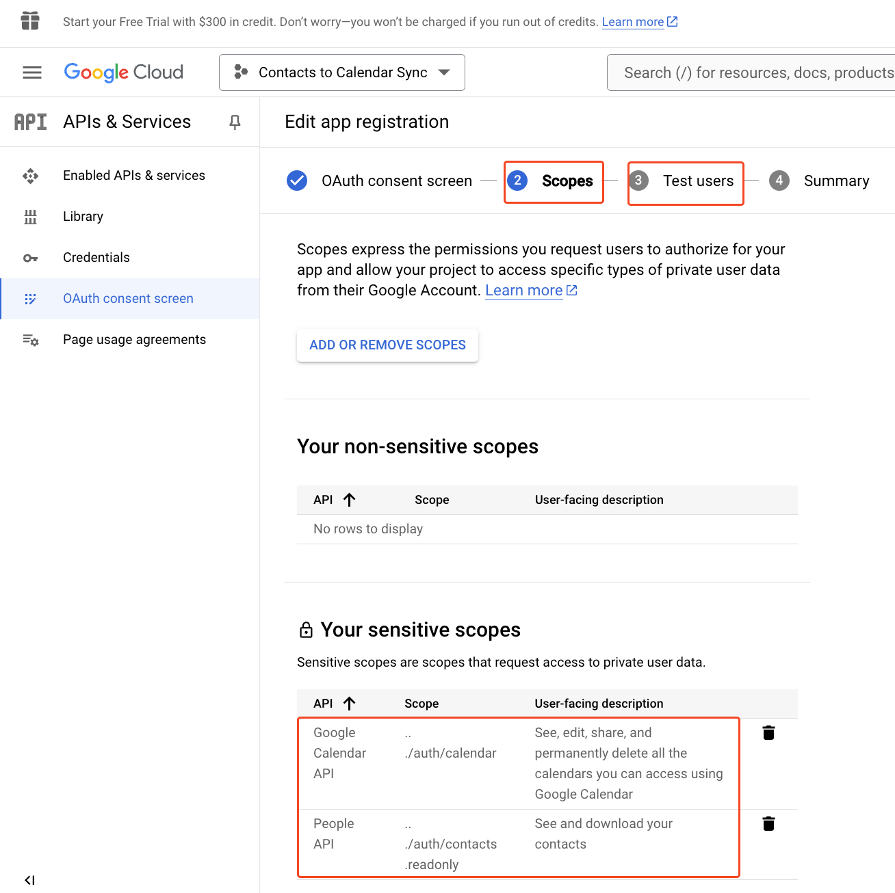
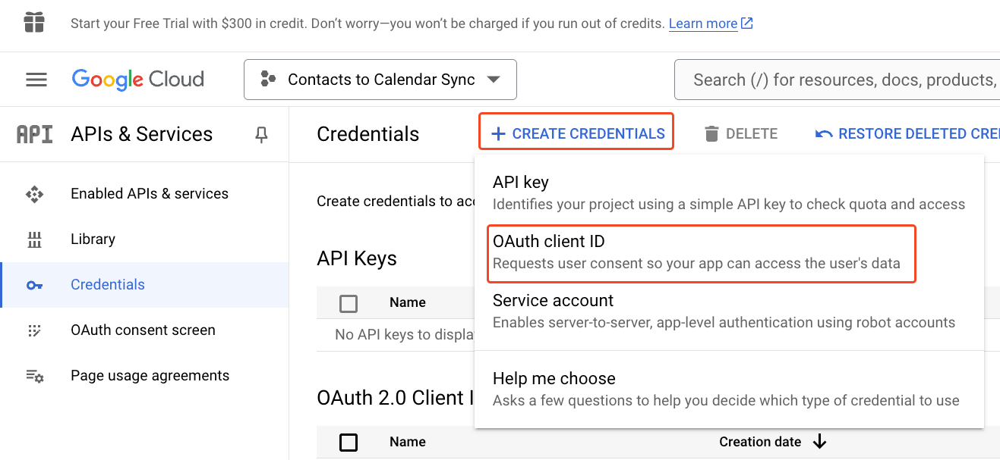
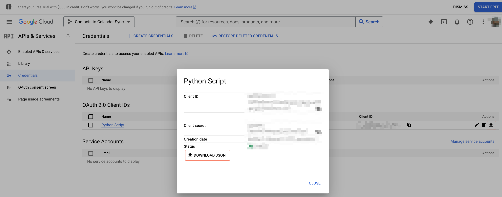
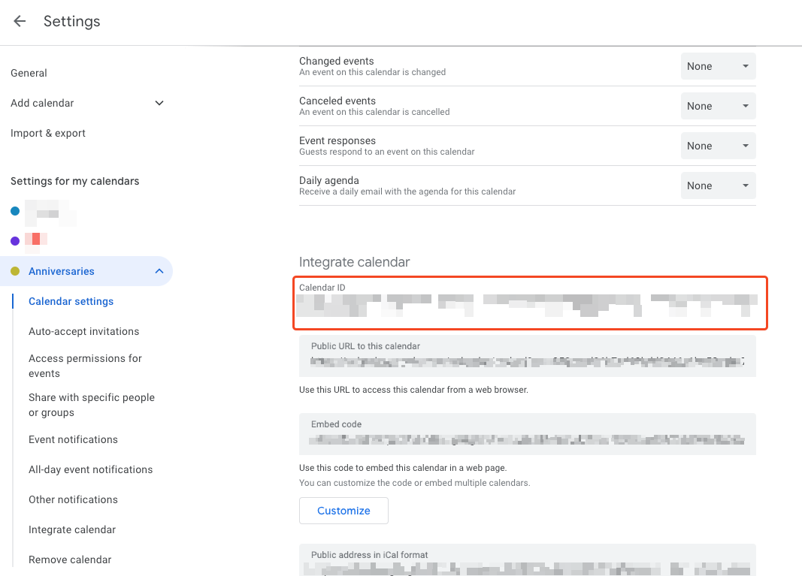

# Google Contacts to Calendar Sync

Syncs all birthdays and anniversaries from Google contacts to Google Calendar.

## How to use

Make sure to read this guide completely before running the script. Undoing the changes might not be straight forward
after the fact.
Right now, the script writes all birthdays and anniversaries blindly into the given calendar, without checking if
there's already an event there. That means it's more of a one way transfer than an actual sync right now.

1. Authenticate to Google via OAuth2
    1. Create a new app on https://console.cloud.google.com/
    2. Enable the `Google Calendar API` and the `Google People API` 
    3. Configure an OAuth consent screen (required for the next step). When asked for scopes, add
       `https://www.googleapis.com/auth/contacts.readonly` and `https://www.googleapis.com/auth/calendar`. When asked
       for test users, enter all the Gmail addresses that you want to sync birthdays for. The app will not be able to
       run
       for other Google accounts.
    4. Create OAuth Credentials. 
    5. Download the OAuth credentials as json and store them as `credentials.json` in the root of this
       project. 
2. Install python dependencies with `pip install -r requirements.txt` from the root of this repo.
3. To run the sync script, call `python google-contacts-to-calendar-sync.py`. When first run (i.e. the `token.json` file
   does not exist yet), it will open a browser and ask for permissions to access your Google Contacts and Google
   Calendar. Grant all permissions. The script doesn't have good error handling (as of 2024-10-03 yet), so you might get
   weird errors when you omit one of the permissions.
4. By default, the script will sync the birthdays and anniversaries to your default calendar. If you want to sync it to
   another calendar, change the `calendar_id` variable at then end of the script to the calendar id you want to use. You
   can find the calendar id in [the Google Calendar WebUI Settings](https://calendar.google.com/r/settings). Use the
   full ID, including the part after the `@`. 

If you want to run the script for a second user, make sure you delete the `token.json` file before.
It's created during the authentication process and is still related to the authentication of the first user.

If you're on macOS or using a venv, you might want to replace `pip` and `python` with `pip3`/`venv/bin/pip` and
`python3`/`venv/bin/python`.

Tip: If you've synced your contacts to a new calendar, you can just delete it and create a new one when you want to
re-sync your contacts. 